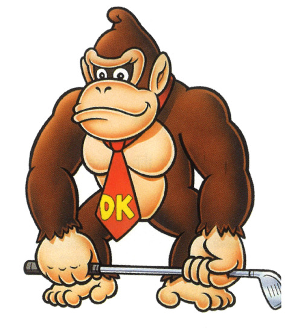
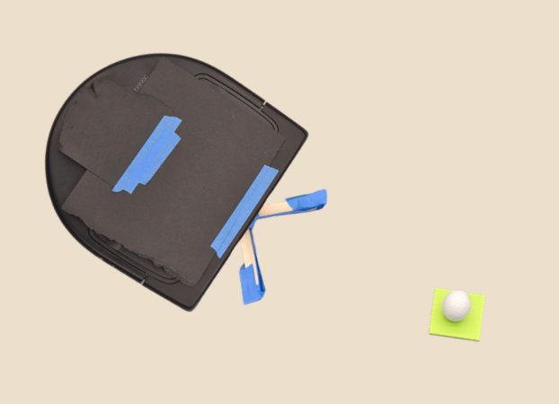
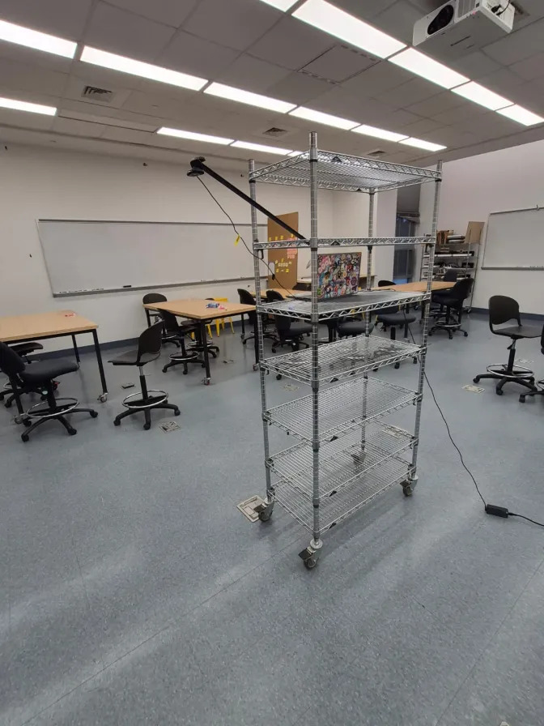

# RUBRIC: 

Writeup (Due 11/11 at 7PM)Permalink

In your code package create a README.md file to hold your project writeup. Your writeup should touch on the following topics. We expect this writeup to be done in such a way that you are proud to include it as part of your professional portfolio. As such, please make sure to write the report so that it is understandable to an external audience. Make sure to add pictures to your report, links to Youtube videos, embedded animated Gifs (these can be recorded with the tool peek).

    What was the goal of your project? Since everyone is doing a different project, you will have to spend some time setting this context.
    How did you solve the problem (i.e., what methods / algorithms did you use and how do they work)? As above, since not everyone will be familiar with the algorithms you have chosen, you will need to spend some xtime explaining what you did and how everything works.
    Describe a design decision you had to make when working on your project and what you ultimately did (and why)? These design decisions could be particular choices for how you implemented some part of an algorithm or perhaps a decision regarding which of two external packages to use in your project.
    What if any challenges did you face along the way?
    What would you do to improve your project if you had more time?
    Did you learn any interesting lessons for future robotic programming projects? These could relate to working on robotics projects in teams, working on more open-ended (and longer term) problems, or any other relevant topic.

# DRAFT WRITEUP
# Neato Golf (ft. Donkey Kong)
### Bill Le, Oscar Bao, Sam Wisnoski

## Project Goals:      
### Introduction:  

  

Has this ever happened to you? You are playing golf against Donkey Kong, the greatest golf player to ever walk the earth. You've played a valiant 17 holes, and are up by one point going into the 18th. But oh no! Donkey Kong shoots first, and gets a hole in one! To claim his legendary hoard of golden bananas (the biggest hoard east of the Mississippi) you must match his shot. How could you possibly make that happen? If you're nodding your head along, also having experienced this common scenario, then we have the solution for you. 

**Let us introduce you to Neato Golf: our autonomous golf assistant that ensures you never miss the hole again.**

  

The goal of our project was to design and implement an autonomous robotic system capable of locating a golf ball within a predefined area and pushing it onto our target. We wanted to explore how computer vision, object tracking, and motion planning could be combined to complete a task. Additionally, we had a few extra constraints when defining our project goal:
* We wanted to use a camera that was not attached to the robot, but could still capture robotic movement.
* We wanted to use entirely CV to do our detection, without having to rely on odometry (or any other sensor) data.
* We wanted to practice working in a (relatively) controlled enviornment.
* We wanted to implement an algorithm to allow detection of multiple golf balls at once. 
  
With the above constraints in mind, our solution is as follows: using a bird's-eye-view camera, our CV algorithm identifies the ball, the hole, and the Neato robot’s position (`x`, `y`, and `heading`). Then, with a SORT tracking algorithm and a simple path planner, it directs the robot to nudge the ball into the target. In essence, our project takes the final shot of golf out of your hands, and puts it into the more than capable end-effector of our robot. As long as you can get your ball to that green, you're *golden*... as golden as a golden banana. 

Not convinced that Neato Golf will work for your needs? Videos of partial and full implementations can be found here:
* [Using SORT to track multiple balls](https://drive.google.com/file/d/1GgMcts5O3wgErzWKcIJOUZaHiJTX-XAM/view?resourcekey)
* [Video of Neato Golf successfully getting a "hole in one"](https://drive.google.com/file/d/1KUzkdHAsaL157LKygHP7LB2IOXnDMdcI/view?resourcekey)

### Individual Learning Goals:
While we each had different goals, overall, we were all very invested in achieving a nontrivial task, i.e. driving a Neato
to capture an object and deliver it to a target, with classic computer vision methods and chaining them together. 
#### Oscar's learning goals:
For this project, I was very interested in converting the data from the software world into some concrete actions
in real life. I've done my time with the `CV2` package by its own, and it was very fun, and challenging, building a data
pipeline that interacts with the `CV2` package. At the same time, I wanted to do something atypical with the camera feed,
which we achieved by using a birds-eye view camera instead of the more typical camera mounted on object. 

#### Sam's learning goals: 
The most important aspect of this project for me was having direct control over a task, working with a tangible robot to get something done. Although that meant we were pretty much limited to Neatos, it was totally worth it for how rewarding it was to get the full implementation working. Additionally, I wanted to practice more image processing skills step by step, being able to track each mask we applied to the image, rather than just running it through a predefined algorithm that spits out a result. 

#### Bill's learning goals:

## Methodology Overview:   
TBD after we finalize code 

### Main loop: 

#### Step 1: ...

#### Step 2: ...

### Final Result:   

## Design Decisions:   

### Calculating the Neato Heading: 
One major design decision we faced was how to determine the Neato’s heading from soley the camera feed. When first approaching this problem, we considered several options: attaching an apriltag to the robot, using PID control to direct it to each location, or (likely the easiest solution) just using odom data. However, our project goals including not relying on the information from the sensors of the robot and using only CV as much as possible. Since we already needed to get a contour of our Neato in order to find the center, we figured we were more than capable of also finding the heading. 

To do this, we decided to use OpenCV’s Hough Line Transform (thanks, Image Processing!) to detect the main line along the Neato’s body from the contour image. Once that line was found, we could calculate its slope and use a bit of algebraic geometry to determine the robot’s heading relative to its center point. Suprisingly, this took us a bit of time to get just right; trying to recall information about the law of sines and how to find the intersection of a line. But ultimately, this approach allowed us to estimate the Neato’s orientation entirely from visual information. As described in our goals, we were able to track both the position and heading of the Neato using only the camera feed, keeping the setup simple, self-contained, and true to the spirit of Donkey Kong.

### Integrating SORT with Path Planning: 

## Challenges & Limitiations:   
We had a few small hiccups in our project, mostly due to variations in enviornment, and one bigger challenge related to system integration. 

Let's start with the smaller challenges, where most of our limitations come from. When setting up and testing out our camera for the first time, we noticed that we could only got a few feet of floor space to drive around it, even with the camera suspended ~7 feet off the ground. Additionally, we noticed that our initial detection functions were very finicky with light, and would only work properly is we placed the camera over areas with less glare and no floor traps. We were able to solve some of these problems by filtering out smaller detected shapes and narrowing our ranges of detection, but it still functions much worse in dim lighting or certain areas of the floor. As for the amount of floor space detected, we tried a few different setups to limited success. My favorite setup is pictured below. 

  

And now, moving onto system integration. Learning from past projects, we decided to go with a more modular approach to our system, defining each part (neato detection, ball/target detection, SORT, driving the neato) individually before integrating fully. We hoped that this would allow us to better test/debug our system and prevent frustration when an error pops up and we have no clue where it's coming from. Our strategy did largely mitigate this problem, but vastly underestimated the extra time it would take to properly implement each leg of the project together, especially when it came to SORT and path planning. 

As we built out the `neato_tracker` node, we had a simple linear drive function that would first turn the neato, then drive it forward (via `time.sleep`) to reach it's location. While this worked, it undermined the SORT algorithm, which tracks the balls in realtime. While it drove forward, regardless of how well SORT was tracking the ball, we couldn't modify the neato trajectory. In the final system, SORT still handled multi-ball tracking and switching balls once the target was reached, but we weren’t able to fully leverage its continuous tracking capabilities.

## Potential Improvements:
One important improvement in the future will be to better integrate our SORT module into the code base. As discussed in the previous section, our current utilization of the SORT node is picking a target ball for us and tracking it throughout. To better incorporate the SORT module, we will have to update both the path planning module and the drive function. The path planning module will have to continuously listen to the output of the SORT node, receive its current coordinate, and plan a path that drives the ball to the target. At the same time, the drive function will most likely have to be updated to variable velocity and uses a clock instead of `time.sleep` so that it can respond to real-time updates of the path. Overall, if these improvements were implemented, the `NeatoTracker` will be able to handle a dynamic field of multiple moving golf balls or objects without getting lost on which ball to pursue.

Another impactful improvement will be to utilize a fisheye lens instead of the regular webcam that we currently employ. Using the fisheye lens will give us a significantly better field-of-view, affording us the ability to increase the size of the "green" and endless other possibilities. We do recognize that using a fisheye lens will require us undertaking exponentially more camera calibration, with the possibility of loss on accuracy because the pixel per sqft. (or any other arbitrary area unit) will inevitably decrease. 

One last potential improvement will be to fine-tune our detection of the objects, be it the Neato, the ball, or the target. We mostly employ color filtering to detect these objects, in line with our goal of sticking to classic CV methods. However, there is the possibility to improve on the accuracy by methods such as normalizing things across different lighting configurations using a lighting/saturation model. The current accuracy is sufficient under control environments that we set, and implementing this improvement will add to the resilience of our model.

## Conclusion:  
### How It Went:

### Lessons Learned: 
